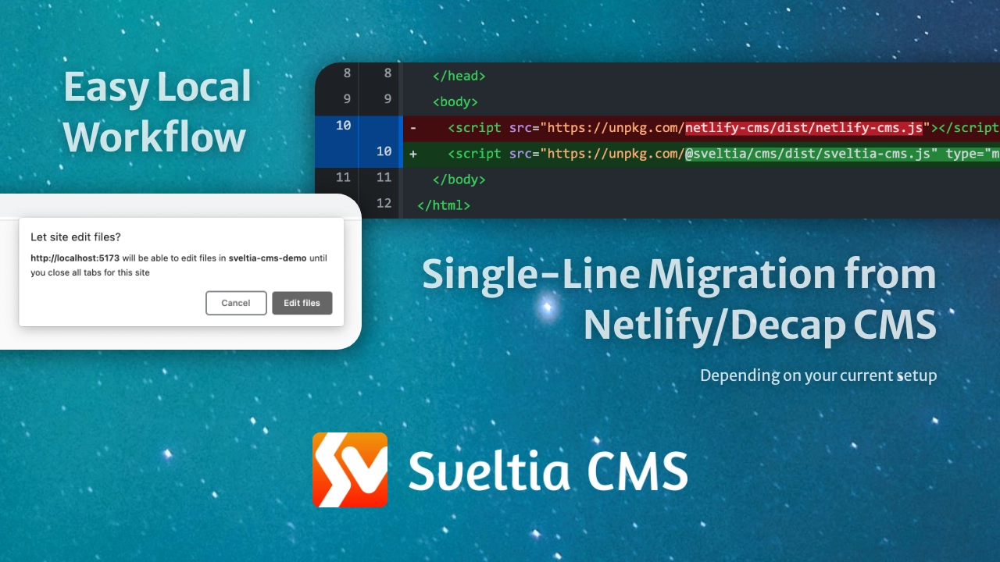

# Sveltia CMS

Sveltia CMS is a Git-based lightweight headless CMS under active development as a modern, quick replacement for Netlify CMS and [Decap CMS](https://decapcms.org/). In some simple cases, migration is as easy as a single line of code change, although we’re still working on improving compatibility. The free, open source, UX-focused alternative to Netlify/Decap CMS is now in public beta — with more features to come.

<br>

<br>

<br>

<br>

<br>

## Motivation

Sveltia CMS was born in November 2022, when the progress of Netlify CMS was stalled for more than six months. [@kyoshino](https://github.com/kyoshino)’s clients wanted to replace their Netlify CMS instances without much effort, mainly to get better internationalization (i18n) support.

To achieve radical improvements in UX, performance, i18n and other areas, it was decided to build an alternative from the ground up, while ensuring an easy migration path from the other. After proving the concept with a rapid [Svelte](https://svelte.dev/) prototype, development was accelerated to address their primary use cases. The new offering has since been named Sveltia CMS and released as open source software to encourage wider adoption.

Our goal is to make it a viable successor to Netlify CMS, expand the Git-based headless CMS market, empower small businesses and individuals who need a simple yet powerful CMS solution, and showcase the huge potential of the Svelte framework.

## Features

We are working hard to create a **much better alternative to Netlify/Decap CMS**. Here’s what makes Sveltia CMS different. (Whoa, there are so many!)

### Compatible with Netlify/Decap CMS

- Ready to replace Netlify/Decap CMS _in some casual use case scenarios_ by updating a single line of code.
- Your existing [configuration file](https://decapcms.org/docs/configuration-options/) can be reused as is.
- Various features are still missing though — look at the [compatibility chart](#compatibility) below to see if you can migrate.

### Better UX

- Created and maintained by an [experienced UX engineer](https://github.com/kyoshino) who loves code and design. You can expect constant UX improvements across the platform.
- Offers a modern, intuitive user interface, including an immersive dark mode[^2], inspired in part by the Netlify CMS v3 prototype[^1].
- Comes with touch device support. While the UI is not yet optimized for small screens, large tablets like iPad Pro or Pixel Tablet should work well.
- Made with Svelte, not React, means we can spend more time on UX rather than tedious state management.
- The screenshots above are worth a thousand words!
- Read on to learn about many other enhancements, including performance, productivity, accessibility, service integrations, and an all-new Asset Library.

### Better performance

- Built completely from scratch with Svelte instead of forking React-based Netlify/Decap CMS. The app starts fast and stays fast. The compiled code is vanilla JavaScript — you can use it with almost any framework.
- Small footprint: The bundle size is less than 300 KB when minified and gzipped, compared to 1.5 MB of Netlify/Decap CMS. And [no virtual DOM overhead](https://svelte.dev/blog/virtual-dom-is-pure-overhead).
- Uses the GraphQL API for GitHub to quickly fetch content at once, so that entries and assets can be listed and searched instantly[^32]. It also avoids the slowness and potential API rate limit violations caused by hundreds of requests with Relation widgets[^14].
- Saving entries and assets is also much faster thanks to the [GraphQL mutation](https://github.blog/changelog/2021-09-13-a-simpler-api-for-authoring-commits/).
- Caches Git files locally to further speed up startup and reduce bandwidth.
- You can [disable automatic deployments](#disable-automatic-deployments) by default or on demand to save costs and resources associated with CI/CD and to publish multiple changes at once[^24].

### Better productivity

- You can [work on a local Git repository](#work-with-a-local-git-repository) without running a proxy server on your machine, bypassing the 30 MB file size limit[^26].
- The Git branch name is automatically set to the repository’s default branch (`main`, `master` or whatever) if not specified in the configuration file, preventing data loading errors due to a hardcoded fallback to `master`[^27].
- Never miss out on the latest features and bug fixes by being notified when an update to the CMS is available[^31].
- You can delete multiple entries and assets at once.
- Some keyboard shortcuts are available for faster editing. More to come!
  - Create a new entry: `Ctrl+E` (Windows/Linux) / `Command+E` (macOS)
  - Save an entry: `Ctrl+S` (Windows/Linux) / `Command+S` (macOS)
  - Search for entries and assets: `Ctrl+F` (Windows/Linux) / `Command+F` (macOS)
- Solves various outstanding Netlify/Decap CMS bugs[^11].

### Better accessibility

- Improved keyboard handling lets you efficiently navigate through UI elements using the Tab, Space, Enter and arrow keys[^17].
- Comprehensive [WAI-ARIA](https://w3c.github.io/aria/) support empowers users who rely on screen readers such as NVDA or VoiceOver.
- Ensures sufficient contrast between the foreground text and background colours.
- Honours your operating system’s [reduced motion](https://developer.mozilla.org/en-US/docs/Web/CSS/@media/prefers-reduced-motion) and [reduced transparency](https://developer.mozilla.org/en-US/docs/Web/CSS/@media/prefers-reduced-transparency) settings.
- We’ll continue to test and improve the application to meet [WCAG 2.2](https://w3c.github.io/wcag/guidelines/22/).

### Better security

- Avoids high/critical severity vulnerabilities through constant dependency updates[^34].
- We have documented how to [set up a Content Security Policy](#set-up-content-security-policy) for the CMS.
- The `unsafe-eval` or `unsafe-inline` keywords are not needed in the `script-src` CSP directive[^33].

### Better i18n support

- It’s now easier to switch between locales while editing with just a click on a button instead of a dropdown list.
- Fields in non-default locales are validated as expected[^13].
- [Integrates DeepL](#use-deepl-to-translate-entry-fields) to allow translation of text fields from another locale with one click.
- You can [disable non-default locale content](#disable-non-default-locale-content)[^15].
- You can [use a random UUID for an entry slug](#use-a-random-id-for-an-entry-slug), which is a good option for locales that write in non-Latin characters.
- Resolves the [limitations in the List and Object widgets](https://decapcms.org/docs/i18n/#limitations) so that changes made with these widgets will be duplicated between locales as expected when using the `i18n: duplicate` field configuration[^7].
- [Entry-relative media folders](https://decapcms.org/docs/collection-folder/#media-and-public-folder) can be used in conjunction with the `multiple_folders` i18n structure[^21].
- Boolean fields are updated in real time between locales like other widgets to avoid confusion[^35].

### Better collections

- You can choose a [custom icon for each collection](#use-a-custom-icon-for-a-collection)[^3].
- A [per-collection media folder](#use-a-custom-media-folder-for-a-collection) will appear next to the entries.
- String values in YAML files can be quoted with the new `yaml_quote: true` option for a collection, mainly for framework compatibility[^9].
- Entry slug template tags support [filter transformations](https://decapcms.org/docs/summary-strings/) just like summary string template tags[^29].
- You can set the maximum number of characters for an entry slug with the new `slug_length` collection option[^25].

### Better fields/widgets

- Required fields, not optional fields, are clearly marked for efficient data entry.
- Leading and trailing spaces in text-type field values are automatically removed when you save the entry[^37].
- You can revert changes to all fields or a specific field.
- You can hide the preview of a specific field with `preview: false`.
- The String widget supports the `type` property that accepts `url` or `email` as a value, which will validate the value as a URL or email.
- The String widget supports the `prefix` and `suffix` string properties, which will be automatically prepended/appended to the user-input value.
- The Boolean, Number and String widgets support the `before_input` and `after_input` string properties, which allow developers to display custom labels before and/or after the input UI[^28].
- Relation field options are displayed with no additional API requests[^14]. The `options_length` property is therefore ignored.
- The `summary` for the List and Object widgets is displayed correctly when it refers to a Relation field[^36].
- Provides a reimagined all-in-one asset selection dialog for File and Image fields.
  - [Collection-specific assets](#use-a-custom-media-folder-for-a-collection) will be listed first for easy selection, while all assets can also be displayed in a separate tab[^19].
  - New assets can be uploaded by dragging & dropping them into the dialog[^20].
  - A file/image URL can also be entered in the dialog.
  - Integration with Pexels, Pixabay and Unsplash makes it easy to select and insert free stock photos[^8].
- The Object widget supports [variable types](https://decapcms.org/docs/variable-type-widgets/) just like the List widget. This allows you to have dependent fields in a collection[^30].
- Optional Object fields (`widget: object` with `required: false`) can be manually added or removed. If unadded or removed, the required subfields won’t trigger validation errors[^16].
- In addition to [generating UUIDs for entry slugs](#use-a-random-id-for-an-entry-slug), Sveltia CMS also supports the proposed `uuid` widget with the following properties[^12]:
  - `prefix`: A string to be prepended to the value. Default: an empty string.
  - `use_b32_encoding`: Whether to encode the value with Base32. Default: `false`.
  - `read_only`: Whether to make the field read-only. Default: `true`.
- The experimental `compute` widget allows to reference the value of other fields in the same collection, similar to the `summary` property for the List and Object widgets. Use the `value` property to define the value template, e.g. `posts-{{fields.slug}}` ([example](https://github.com/sveltia/sveltia-cms/issues/111)).

### Better asset management

- A completely new Asset Library, built separately from the image selection dialog, makes it easy to manage all of your files, including images, videos and documents.
  - You can sort or filter assets by name or file type and view asset details, including size, dimensions, and a list of entries that use the selected asset.
  - You can upload multiple assets at once, including files in nested folders, by browsing or dragging & dropping them into the library[^5].
  - You can navigate between the global media folder and per-collection media folders[^6].
- Assets stored in an entry-relative media folder are automatically deleted when the associated entry is deleted because these assets are not available for other entries[^22].

## Compatibility

While it’s not our goal to recreate all the features found in Netlify/Decap CMS, we plan to maximize compatibility before the 1.0 release so that more users can migrate to our modern alternative. The table below is a summary of the current limitations of Sveltia CMS:

| Feature | Status in Sveltia CMS |
| --- | --- |
| Installation | Installing with `npm` is not supported yet. |
| Backends | Only the GitHub backend is available at this time. Sveltia CMS uses the GraphQL by default for a better performance; it cannot be disabled. The GitLab backend will be available soon. We plan to add the Test backend as well for our demo site as well, but Azure and Bitbucket will probably not be supported, mainly due to the lack of a method to fetch content in bulk. We have not looked into the relatively new Gitea backend yet. |
| Netlify Integration | Identity Widget is not supported yet. We will not support Git Gateway due to the poor performance; we may implement an alternative using GraphQL later. |
| Local Git Repository | Supported using a different approach. [See below](#work-with-a-local-git-repository) for details. |
| UI Locales | Only English and Japanese are available at this time. No registration is needed. While the UI locale is automatically selected depending on the browser’s language settings, it can be changed in Settings. (Click on the Account button in the top right corner of the CMS.) |
| Media Libraries | External media storage services are not supported yet. We will add support for Cloudinary and Uploadcare in a better way, but will not support deprecated Netlify Large Media. |
| Editorial Workflow | Not supported yet. |
| Open Authoring | Not supported yet. |
| Collections | Nested collections are not supported yet. |
| Widgets | [See below](#widget-limitations) for the current limitations. |
| Customizations | Custom widgets, custom previews, custom formatters, manual initialization and CMS event subscriptions are not supported yet. |

### Widget limitations

| Widget | Status in Sveltia CMS |
| --- | --- |
| Code | Not supported yet. |
| Color | The `enableAlpha` option is not supported yet. |
| Date | Sveltia CMS has dropped the support for it following Decap CMS 3.0. Use the DateTime widget instead. |
| DateTime | The `date_format` and `time_format` options with Moment.js tokens are not supported yet. Note: Decap CMS 3.1 has replaced Moment.js with [Day.js](https://day.js.org/); we’ll follow the change soon. |
| File/Image | Field-specific media folders and media library options are not supported yet other than `media_library.config.max_file_size` for the default media library. |
| Map | Not supported yet. |
| Markdown | It’s a plain text editor at this time. A rich text editor is coming soon. We will not support Remark plugins. |
| Relation | The `search_fields` option is not supported yet. |

### Other features

- Comprehensive config validation is not implemented yet.
- Auto-saving a draft entry is not implemented yet.
- Downloading an asset and copying the file path of an asset in the media library is not implemented yet.
- [Backend health check](https://www.githubstatus.com/api) is not implemented yet.

## Roadmap

### Before the 1.0 release

- [Svelte 5](https://svelte.dev/blog/runes) migration
- Further Netlify/Decap CMS compatibility, including Editorial Workflow
- Localization
- Documentation
- Marketing site
- Demo site
- Starter templates

### After the 1.0 release

- Roles[^23]
- Config editor[^10]
- Mobile support[^18]

## Getting started

### New users

Currently, Sveltia CMS is primarily intended for existing Netlify/Decap CMS users. If you don’t have it yet, follow [their documentation](https://decapcms.org/docs/basic-steps/) to add it to your site and create a configuration file first. Then migrate to Sveltia CMS as described below.

As the product evolves, we’ll implement a built-in configuration editor and provide comprehensive documentation to make it easier for everyone to get started with Sveltia CMS.

Here are some starter kits for popular frameworks created by community members. More to follow!

- [Eleventy starter template](https://github.com/danurbanowicz/eleventy-sveltia-cms-starter) by [@danurbanowicz](https://github.com/danurbanowicz)
- [Hugo module](https://github.com/privatemaker/headless-cms) by [@privatemaker](https://github.com/privatemaker)
- Astro: [astro-sveltia-cms](https://github.com/majesticostudio/astro-sveltia-cms), [astro-starter](https://github.com/zankhq/astro-starter) and [astros](https://github.com/zankhq/astros) by [@zanhk](https://github.com/zanhk)

Alternatively, you can probably use one of the [Netlify/Decap CMS templates](https://decapcms.org/docs/start-with-a-template/) and make a quick migration to Sveltia CMS.

### Migration

Have a look at the [compatibility chart](#compatibility) above first. If you’re already using Netlify/Decap CMS with the GitHub backend and don’t have any custom widget, custom preview or plugin, migrating to Sveltia CMS is super easy. Edit `/admin/index.html` to replace the CMS `script` tag, and push the change to your repository:

```diff
-<script src="https://unpkg.com/netlify-cms@^2.0.0/dist/netlify-cms.js"></script>
+<script src="https://unpkg.com/@sveltia/cms/dist/sveltia-cms.js" type="module"></script>
```

That’s it! You can open `https://[hostname]/admin/` as before to start editing. There is even no authentication process if you’ve already been signed in with GitHub on Netlify/Decap CMS because Sveltia CMS uses your auth token stored in the browser. Simple enough!

That said, we strongly recommend testing your new Sveltia CMS instance first on your local machine. [See below](#work-with-a-local-git-repository) for how.

## Tips & tricks

### Move your site from Netlify to another hosting service

You can host your Sveltia CMS-managed site anywhere, such as [Cloudflare Pages](https://pages.cloudflare.com/) or [GitHub Pages](https://pages.github.com/). But moving away from Netlify means you can no longer sign in with GitHub via Netlify. Instead, you can use [our own OAuth client](https://github.com/sveltia/sveltia-cms-auth), which can be easily deployed to Cloudflare Workers, or [any other 3rd party client](https://decapcms.org/docs/external-oauth-clients/) made for Netlify/Decap CMS.

### Work with a local Git repository

You can use Sveltia CMS with a local Git repository like [Netlify/Decap CMS](https://decapcms.org/docs/working-with-a-local-git-repository/), but Sveltia CMS has simplified the workflow by removing the need for additional configuration (the `local_backend` property) and proxy server, thanks to the [File System Access API](https://developer.chrome.com/articles/file-system-access/) available in [some modern browsers](https://developer.mozilla.org/en-US/docs/web/api/window/showopenfilepicker#browser_compatibility).

1. Launch the local development server for your frontend framework, typically with `npm run dev` or `pnpm dev`.
1. Visit `http://localhost:[port]/admin/index.html` with Chrome or Edge. The port number varies by framework.
   - Other Chromium-based browsers may also work. In Brave, you need to enable the File System Access API [with a flag](https://github.com/brave/brave-browser/issues/20563#issuecomment-1021567573).
1. Click “Work with Local Repository” and select the project’s root directory once prompted.
   - If you’re using Windows Subsystem for Linux (WSL), you may get an error saying “Can’t open this folder because it contains system files.” This is due to a limitation in the browser, and you can try some workarounds mentioned in [this issue](https://github.com/coder/code-server/issues/4646) and [this thread](https://github.com/sveltia/sveltia-cms/discussions/101).
1. Make some changes to your content on Sveltia CMS.
1. See if the produced changes look good using `git diff` or a GUI like [GitHub Desktop](https://desktop.github.com/).
1. Open the dev site at `http://localhost:[port]/` to check the rendered pages.
1. Commit and push the changes if satisfied, or discard them if you’re just testing.

Remember that the local repository support doesn’t do any Git operation. You have to fetch, pull, commit and push all changes manually with a Git client. Also, at this point, you have to reload the CMS to see the latest content after retrieving remote updates (this will be unnecessary once browsers support the proposed `FileSystemObserver` API).

### Use a custom icon for a collection

You can have an icon for each collection for easy identification in the collection list.

1. Visit the [Material Symbols](https://fonts.google.com/icons?icon.set=Material+Symbols&icon.platform=android) page on Google Fonts.
1. Search and select an icon, and copy the icon name displayed on the right panel.
1. Add it to one of your collection definitions in `config.yml` as the new `icon` property, like the example below.
1. Repeat the same steps for all the collections if desired.
1. Commit and push the changes to your Git repository.
1. Reload Sveltia CMS once the updated config file is deployed.

```diff
   - name: tags
     label: Tags
+    icon: sell
     create: true
     folder: data/tags/
```

### Use a custom media folder for a collection

This is actually not new in Sveltia CMS but rather an _undocumented_ feature in Netlify/Decap CMS[^4]. You can specify media and public folders for each collection that override the [global media folder](https://decapcms.org/docs/configuration-options/#media-and-public-folders). Well, it’s [documented](https://decapcms.org/docs/collection-folder/#media-and-public-folder), but that’s probably not what you want.

Rather, if you’d like to add all the media files for a collection in one single folder, specify both `media_folder` and `public_folder` instead of leaving them empty. The trick is to use an _absolute path_ for `media_folder` like the example below. You can try this with Netlify/Decap CMS first if you prefer.

```diff
 media_folder: static/media
 public_folder: /media

 collections:
   - name: products
     label: Products
     create: true
     folder: data/products/
+    media_folder: /static/media/products
+    public_folder: /media/products
```

In Sveltia CMS, those per-collection media folders are displayed prominently for easier asset management.

### Use DeepL to translate entry fields

Sveltia CMS comes with a handy DeepL integration so that you can translate any text field from another locale without leaving the content editor. To enable the high-quality, quick translation feature:

1. Update your configuration file to enable the [i18n support](https://decapcms.org/docs/i18n/) with multiple locales.
1. Sign up for [DeepL API](https://www.deepl.com/pro-api/) and copy your Authentication Key from DeepL’s Account page.
1. Go back to Sveltia CMS, click on the Account button in the top right corner, then click Settings.
1. Paste your key to the DeepL API Authentication Key field, and close the Settings dialog.
1. Open any entry, and you can now translate all fields or individual fields by selecting Translate from the three-dot menu.
1. If you have upgraded to DeepL API Pro, provide your new Authentication Key in the same way.

### Disable non-default locale content

You can now disable output of content in selected non-default locales by adding the `save_all_locales` property to the top-level or per-collection `i18n` configuration. Then you’ll find “Disable (locale name)” in the three-dot menu in the top right corner of the content editor. This is useful if the translation isn’t ready yet, but you want to publish the default locale content first.

With the following configuration, you can disable the French and/or German translation while writing in English.

```diff
 i18n:
   structure: multiple_files
   locales: [en, fr, de]
   default_locale: en
+  save_all_locales: false
```

### Use a random ID for an entry slug

By default, the [slug for a new entry file](https://decapcms.org/docs/configuration-options/#slug) will be generated based on the entry’s `title` field. Or, you can specify the collection’s `slug` option to use the file creation date or other fields. While the behaviour is generally acceptable and SEO-friendly, it’s not useful if the title might change later or if it contains non-Latin characters like Chinese. In Sveltia CMS, you can easily generate a random [UUID](https://developer.mozilla.org/en-US/docs/Glossary/UUID) for a slug without a custom widget!

It’s simple — just specify `{{uuid}}` (full UUID v4), `{{uuid_short}}` (last 12 characters only) or `{{uuid_shorter}}` (first 8 characters only) in the `slug` option. The results would look like `4fc0917c-8aea-4ad5-a476-392bdcf3b642`, `392bdcf3b642` and `4fc0917c`, respectively.

```diff
   - name: members
     label: Members
     create: true
     folder: data/members/
+    slug: '{{uuid_short}}'
```

### Disable automatic deployments

You may already have a CI/CD tool set up on your Git repository to automatically deploy changes to production. Occasionally, you make a lot of changes to your content to quickly reach the CI/CD provider’s (free) build limits, or you just don’t want to see builds triggered for every single small change.

With Sveltia CMS, you can disable automatic deployments by default and manually trigger deployments at your convenience. This is done by adding the `[skip ci]` prefix to commit messages, the convention supported by [GitHub](https://docs.github.com/en/actions/managing-workflow-runs/skipping-workflow-runs), [GitLab](https://docs.gitlab.com/ee/ci/pipelines/#skip-a-pipeline), [CircleCI](https://circleci.com/docs/skip-build/#skip-jobs), [Travis CI](https://docs.travis-ci.com/user/customizing-the-build/#skipping-a-build), [Netlify](https://docs.netlify.com/site-deploys/manage-deploys/#skip-a-deploy), [Cloudflare Pages](https://developers.cloudflare.com/pages/platform/branch-build-controls/#skip-builds) and others. Here are the steps to use it:

1. Add the new `automatic_deployments` property to your `backend` configuration with a value of `false`:
   ```diff
    backend:
      name: github
      repo: owner/repo
      branch: main
   +  automatic_deployments: false
   ```
1. Commit and deploy the change to the config file and reload the CMS.
1. Now, whenever you save an entry or asset, `[skip ci]` is automatically added to each commit message. However, deletions are always committed without the prefix to avoid unexpected data retention on your site.
1. If you want to deploy a new or updated entry, as well as any other unpublished entries and assets, click an arrow next to the Save button in the content editor, then select **Save and Publish**. This will trigger CI/CD by omitting `[skip ci]`.

If you set `automatic_deployments` to `true`, the behaviour is reversed. CI/CD will be triggered by default, while you have an option to **Save without Publishing** that adds `[skip ci]` only to the associated commit.

_Gotcha:_ Unpublished entries and assets are not drafts. Once committed to your repository, those changes can be deployed any time another commit is pushed without `[skip ci]`, or when a manual deployment is triggered.

If the `automatic_deployments` property is defined, you can manually trigger a deployment by selecting **Publish Changes** under the Account button in the top right corner of the CMS. To use this feature:

- GitHub Actions:
  1. Without any configuration, Publish Changes will [trigger a `repository_dispatch` event](https://docs.github.com/en/rest/repos/repos#create-a-repository-dispatch-event) with the `sveltia-cms-publish` event type. Update your build workflow to receive this event:
     ```diff
      on:
        push:
          branches: [$default-branch]
     +  repository_dispatch:
     +    types: [sveltia-cms-publish]
     ```
- Other CI/CD providers:
  1. Select Settings under the Account button in the top right corner of the CMS.
  1. Select the Advanced tab.
  1. Enter the deploy hook URL for your provider, e.g. [Netlify](https://docs.netlify.com/configure-builds/build-hooks/) or [Cloudflare Pages](https://developers.cloudflare.com/pages/platform/deploy-hooks/).
  1. Configure the CSP if necessary. See below.

### Set up Content Security Policy

If your site adopts Content Security Policy (CSP), use the following policy for Sveltia CMS, or some features may not work.

```csp
style-src 'self' 'unsafe-inline' https://fonts.googleapis.com;
font-src 'self' https://fonts.gstatic.com;
img-src 'self' blob: data:;
script-src 'self' https://unpkg.com;
connect-src 'self' blob: data:;
```

And combine the following policies depending on your Git backend and enabled integrations.

- GitHub:
  ```csp
  img-src https://avatars.githubusercontent.com https://raw.githubusercontent.com;
  connect-src https://api.github.com https://www.githubstatus.com;
  ```
- Pexels:
  ```csp
  img-src https://images.pexels.com;
  connect-src https://images.pexels.com https://api.pexels.com;
  ```
- Pixabay:
  ```csp
  img-src https://pixabay.com;
  connect-src https://pixabay.com;
  ```
- Unsplash:
  ```csp
  img-src https://images.unsplash.com;
  connect-src https://images.unsplash.com https://api.unsplash.com;
  ```
- DeepL API Free:
  ```csp
  connect-src https://api-free.deepl.com;
  ```
- DeepL API Pro:
  ```csp
  connect-src https://api.deepl.com;
  ```

If you choose to [disable automatic deployments](#disable-automatic-deployments) and have configured a webhook URL, you may need to add the origin to the `connect-src` directive. For example,

- Netlify:
  ```csp
  connect-src https://api.netlify.com;
  ```
- Cloudflare Pages
  ```csp
  connect-src https://api.cloudflare.com;
  ```

If you have image field(s) and expect that images will be inserted as URLs, you may want to allow any source using a wildcard instead of specifying individual origins:

```csp
img-src 'self' blob: data: https://*;
```

### Self-host the CMS

Sveltia CMS is open source for sure! You can host it on your server rather than loading it from UNPKG, though it’s not recommended due to missing bug fixes. Simply copy the latest [`sveltia-cms.js`](https://unpkg.com/@sveltia/cms/dist/sveltia-cms.js) file from the CDN, or build it yourself:

1. Clone this Git repository.
1. Run `pnpm install && pnpm build` at the project root.
1. `sveltia-cms.js` will be generated under the `dist` directory.

Importing the CMS as an npm package is not supported yet.

## Support & feedback

Visit the [Discussions](https://github.com/sveltia/sveltia-cms/discussions) page on this GitHub repository and start a new discussion. Tell us about your use cases!

Want to build a website with Sveltia CMS? Maintainer [@kyoshino](https://github.com/kyoshino) is available for hire depending on your requirements.

## Contributions

Sveltia CMS is still in early beta, so we do expect various problems. Please [report any bugs to us](https://github.com/sveltia/sveltia-cms/issues/new). Feel free to submit feature requests as well. Meanwhile, pull requests may not be accepted for the time being due to limited review resources. As we get closer to the 1.0 release, we’ll be welcoming [localizers](https://github.com/sveltia/sveltia-cms/blob/main/src/lib/locales/README.md).

## Related links

- Introducing Sveltia CMS: a short technical presentation by [@kyoshino](https://github.com/kyoshino) during the _This Week in Svelte_ online meetup on March 31, 2023 — [recording](https://youtu.be/-YjLubiieYs?t=1660) & [slides](https://docs.google.com/presentation/d/1Wi4ty-1AwOp2-zy7LctmzCV4rrdYPfke9NGhO0DdRdM)

## Disclaimer

This software is provided “as is” without any express or implied warranty. We are not obligated to provide any support for the application. This product is not affiliated with or endorsed by Netlify, Decap CMS or any other integrated services. All product names, logos, and brands are the property of their respective owners.

[^1]: Netlify/Decap CMS [#2557](https://github.com/decaporg/decap-cms/issues/2557)
[^2]: Netlify/Decap CMS [#3267](https://github.com/decaporg/decap-cms/issues/3267)
[^3]: Netlify/Decap CMS [#1040](https://github.com/decaporg/decap-cms/issues/1040)
[^4]: Netlify/Decap CMS [#3671](https://github.com/decaporg/decap-cms/issues/3671)
[^5]: Netlify/Decap CMS [#1032](https://github.com/decaporg/decap-cms/issues/1032)
[^6]: Netlify/Decap CMS [#3240](https://github.com/decaporg/decap-cms/issues/3240)
[^7]: Netlify/Decap CMS [#4386](https://github.com/decaporg/decap-cms/issues/4386), [#6978](https://github.com/decaporg/decap-cms/issues/6978)
[^8]: Netlify/Decap CMS [#2579](https://github.com/decaporg/decap-cms/issues/2579)
[^9]: Netlify/Decap CMS [#3505](https://github.com/decaporg/decap-cms/issues/3505)
[^10]: Netlify/Decap CMS [#341](https://github.com/decaporg/decap-cms/issues/341), [#1167](https://github.com/decaporg/decap-cms/issues/1167)
[^11]: Netlify/Decap CMS [#1382](https://github.com/decaporg/decap-cms/issues/1382), [#1424](https://github.com/decaporg/decap-cms/issues/1424), [#2370](https://github.com/decaporg/decap-cms/issues/2370), [#5596](https://github.com/decaporg/decap-cms/issues/5596), [#5752](https://github.com/decaporg/decap-cms/issues/5752), [#6994](https://github.com/decaporg/decap-cms/issues/6994) and more. We’ll be updating this list after reviewing their issue list.
[^12]: Netlify/Decap CMS [#1975](https://github.com/decaporg/decap-cms/issues/1975)
[^13]: Netlify/Decap CMS [#5112](https://github.com/decaporg/decap-cms/issues/5112), [#5653](https://github.com/decaporg/decap-cms/issues/5653)
[^14]: Netlify/Decap CMS [#4635](https://github.com/decaporg/decap-cms/issues/4635), [#4738](https://github.com/decaporg/decap-cms/issues/4738), [#5920](https://github.com/decaporg/decap-cms/issues/5920), [#6410](https://github.com/decaporg/decap-cms/issues/6410)
[^15]: Netlify/Decap CMS [#6932](https://github.com/decaporg/decap-cms/issues/6932)
[^16]: Netlify/Decap CMS [#2103](https://github.com/decaporg/decap-cms/issues/2103)
[^17]: Netlify/Decap CMS [#1333](https://github.com/decaporg/decap-cms/issues/1333), [#7077](https://github.com/decaporg/decap-cms/issues/7077)
[^18]: Netlify/Decap CMS [#441](https://github.com/decaporg/decap-cms/issues/441)
[^19]: Netlify/Decap CMS [#5910](https://github.com/decaporg/decap-cms/issues/5910)
[^20]: Netlify/Decap CMS [#4563](https://github.com/decaporg/decap-cms/issues/4563)
[^21]: Netlify/Decap CMS [#4781](https://github.com/decaporg/decap-cms/issues/4781)
[^22]: Netlify/Decap CMS [#6642](https://github.com/decaporg/decap-cms/issues/6642)
[^23]: Netlify/Decap CMS [#2](https://github.com/decaporg/decap-cms/issues/2)
[^24]: Netlify/Decap CMS [#6831](https://github.com/decaporg/decap-cms/issues/6831)
[^25]: Netlify/Decap CMS [#526](https://github.com/decaporg/decap-cms/issues/526), [#6987](https://github.com/decaporg/decap-cms/issues/6987)
[^26]: Netlify/Decap CMS [#3285](https://github.com/decaporg/decap-cms/issues/3285), [#6731](https://github.com/decaporg/decap-cms/issues/6731)
[^27]: Netlify/Decap CMS [#3285](https://github.com/decaporg/decap-cms/issues/5617)
[^28]: Netlify/Decap CMS [#6836](https://github.com/decaporg/decap-cms/pull/6836)
[^29]: Netlify/Decap CMS [#4783](https://github.com/decaporg/decap-cms/issues/4783)
[^30]: Netlify/Decap CMS [#565](https://github.com/decaporg/decap-cms/issues/565)
[^31]: Netlify/Decap CMS [#1045](https://github.com/decaporg/decap-cms/issues/1045), [#3353](https://github.com/decaporg/decap-cms/issues/3353)
[^32]: Netlify/Decap CMS [#302](https://github.com/decaporg/decap-cms/issues/302), [#5549](https://github.com/decaporg/decap-cms/issues/5549)
[^33]: Netlify/Decap CMS [#6513](https://github.com/decaporg/decap-cms/issues/6513)
[^34]: Netlify/Decap CMS [#2138](https://github.com/decaporg/decap-cms/issues/2138)
[^35]: Netlify/Decap CMS [#7086](https://github.com/decaporg/decap-cms/issues/7086)
[^36]: Netlify/Decap CMS [#6325](https://github.com/decaporg/decap-cms/issues/6325)
[^37]: Netlify/Decap CMS [#1481](https://github.com/decaporg/decap-cms/issues/1481)
