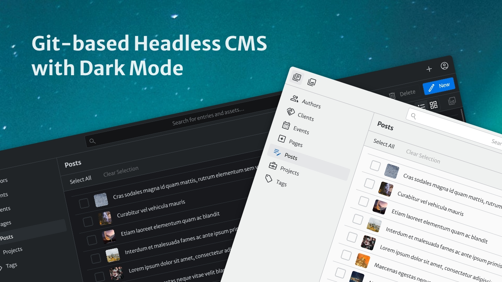
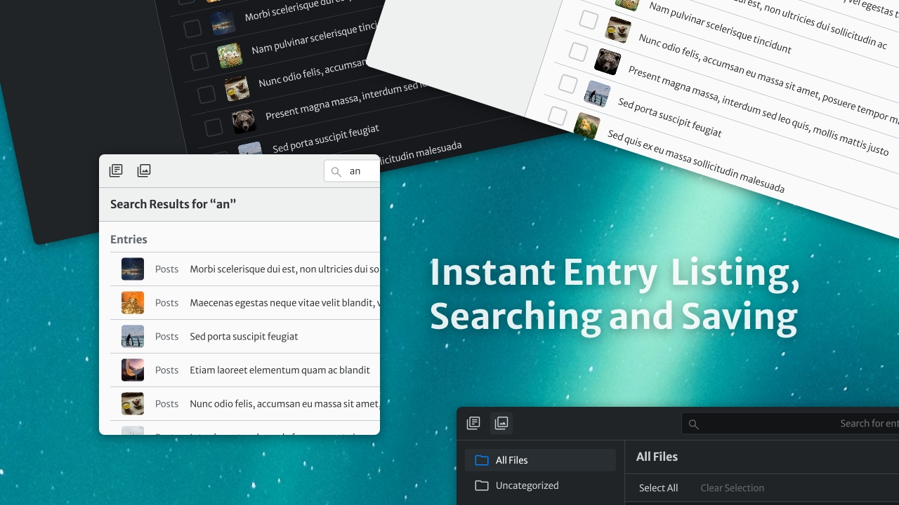
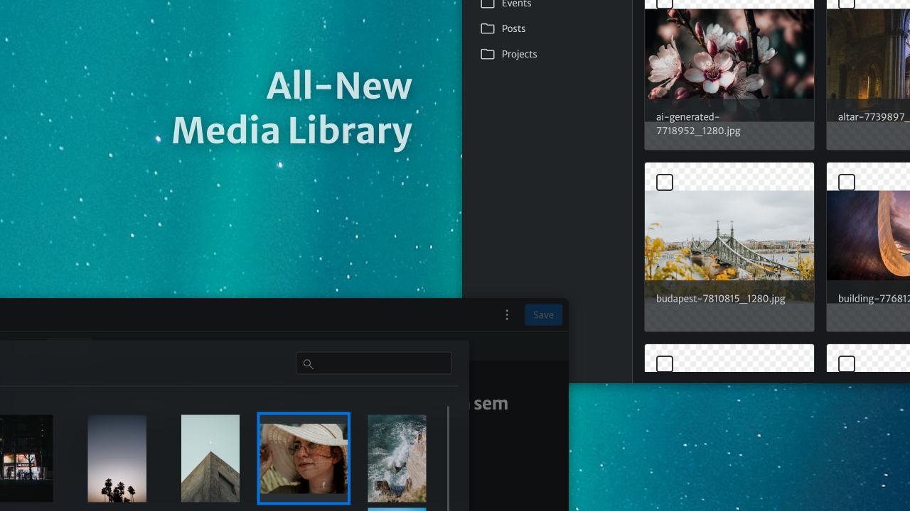
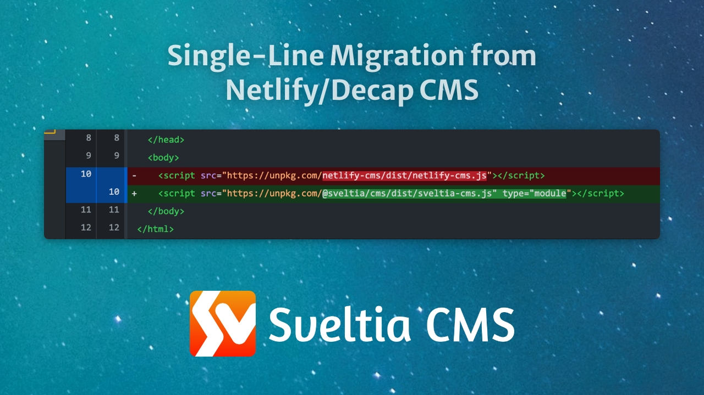

# Sveltia CMS

Sveltia CMS is a Git-based lightweight headless CMS partially compatible with [Netlify/Decap CMS](https://decapcms.org/). You can use it with any static site generator, such as SvelteKit, Next.js and Hugo, to manage the content as static files on a Git repository. The product is now in public beta, with more features to come.

<br>

<br>

<br>

<br>

<br>

## Features

Sveltia CMS is a Git-based lightweight headless CMS, which means:

- Git-based: Your content is saved as static JSON, YAML or TOML files on a Git repository. No database or API is involved.
- Lightweight: The app is compiled as a single small JavaScript file served via a CDN. You don’t have to sign up for a service or install the software.
- Headless: The CMS only takes care of raw data. You can read it and render the final content with your favourite framework.

Here are some highlights mainly compared to Netlify/Decap CMS:

### Compatible with Netlify/Decap CMS

- Ready to replace Netlify/Decap CMS _in some casual use case scenarios_ by updating one single line of code.
- Existing [configuration files](https://decapcms.org/docs/configuration-options/) can be reused as is.
- Many features are still missing though; [see the chart below](#compatibility) for details.

### Better UX

- Offering a modern, intuitive UI, with some inspiration from the Netlify/Decap CMS v3 prototype[^1].
- Immersive dark mode[^2].
- The screenshots above are worth a thousand words!

### Better performance

- Built completely from scratch with [Svelte](https://svelte.dev/) rather than forking React-based Netlify/Decap CMS. The app starts fast and stays fast.
- Using the GraphQL API for GitHub by default to fetch contents quickly at once, so showing and searching entries and media are now instant. Saving entries and media is also much faster.
- Small footprint: less than 250 KB when minified and gzipped, compared to 1.5 MB of Netlify/Decap CMS.

### Better productivity

- Integrating Pexels, Pixabay and Unsplash to allow inserting free stock photos into image fields with no hassle.
- Able to work on a local Git repository without having to run a proxy server. [See below](#work-with-a-local-git-repository) for details.
- Able to delete multiple entries and assets at once.
- Solving various outstanding Netlify/Decap CMS bugs[^11].

### Better i18n support

- Making it easier to switch between locales while editing.
- Integrating DeepL to allow translating text fields from another locale with one click. [See below](#use-deepl-to-translate-entry-fields) for details.
- You can now use a random ID for an entry slug, which is a good option for locales writing in non-Latin characters. [See below](#use-a-random-id-for-an-entry-slug) for details.
- Solving limitations in Netlify/Decap CMS’s [list and object widgets](https://decapcms.org/docs/beta-features/#i18n-support) so that changes made with these widgets will be duplicated between locales as expected[^7].
- Users can now choose their preferred UI locale.

### Collection enhancements

- You can set an icon for each collection[^3]. [See below](#use-a-custom-icon-for-a-collection) for details.
- A per-collection media folder will now appear aside of entries. [See below](#use-a-custom-media-folder-for-a-collection) for details.

### Media library enhancements

- A whole new media library makes it easier to manage all your assets.
- You can upload multiple assets at once, including files in nested folders, by browsing or dragging & dropping them into the media library[^5].
- You can now navigate between the global media folder and a per-collection media folder[^6].

## Compatibility

While we’re not recreating all the features found in Netlify/Decap CMS, our plan is to gradually expand the compatible areas where possible so that more users can migrate to our modern alternative.

| Feature | Status in Sveltia CMS |
| --- | --- |
| UI locales | Only English and Japanese are available at this time. No registration is needed. It can be changed in Preferences. |
| Account | Only the GitHub backend is available at this time. You can keep using Netlify or a [3rd party OAuth client](https://decapcms.org/docs/external-oauth-clients/) (or [our own OAuth client](https://github.com/sveltia/sveltia-cms-auth)) to sign in with GitHub, just like Netlify/Decap CMS. GitLab could be supported later, but other backends are unlikely to be added, mainly due to the lack of an API method fetching contents in bulk. We’ll support the `test-repo` backend for a demo site. |
| Configuration | Supported. |
| Media | External media storage services are not yet supported. |
| Editorial Workflow | Coming soon. |
| Collections | Supported. |
| Widgets | [See below](#widget-limitations) for the current limitations. |
| Custom widgets | Not yet supported. |
| Custom previews | Not yet supported. |

### Widget limitations

| Widget | Status in Sveltia CMS |
| --- | --- |
| Code | Not yet supported. |
| Color | It’s a native `<input>` element at this time. The `enableAlpha` option is not yet supported. |
| Date/DateTime | It’s also a native `<input>` element. The `date_format` and `time_format` options with Moment.js tokens are not yet supported. We may deprecate the Moment.js format support anyway. |
| File/Image | The `media_library` options are not yet supported other than `max_file_size` and `choose_url`. |
| List/Object | We haven’t tested with deeply nested fields. |
| Map | Not yet supported. |
| Markdown | It’s a plain text editor at this time. We’ll soon implement a rich text editor with i18n issues addressed. |
| Relation | The `search_fields` and `file` options are not yet supported. The `options_length` option will be ignored because it confuses users and Sveltia CMS doesn’t have the search performance issue. |

### Beta features in Netlify/Decap CMS

| Feature | Status in Sveltia CMS |
| --- | --- |
| Working with a Local Git Repository | Supported. [See below](#work-with-a-local-git-repository) for details. |
| GitLab and BitBucket Editorial Workflow Support | The GitLab backend is not yet supported. No plan to support BitBucket. |
| i18n Support | Supported. In fact, i18n is at the core of Sveltia CMS! |
| GitHub GraphQL API | Sveltia CMS uses GraphQL with no configuration. It cannot be disabled. |
| GitLab GraphQL API | The GitLab backend is not yet supported. |
| Open Authoring | Not yet supported. |
| Folder Collections Path | Not yet supported. |
| Folder Collections Media and Public Folder | Only the _undocumented_, absolute path per-collection folder configuration is currently supported. [See below](#use-a-custom-media-folder-for-a-collection). |
| List Widget: Variable Types | Coming soon. |
| Custom Mount Element | Supported. |
| Manual Initialization | Not yet supported. |
| Raw CSS in registerPreviewStyle | Not yet supported. |
| Squash merge GitHub pull requests | Editorial workflow is not yet supported. |
| Commit Message Templates | Supported. |
| Image widget file size limit | Supported. |
| Summary string template transformations | Supported. |
| Registering to CMS Events | Not yet supported. |
| Dynamic Default Values | Not yet supported. |
| Nested Collections | Not yet supported. |
| Remark plugins | Not yet supported. |

### Known issues

- Auto-saving a draft entry isn’t implemented yet.
- Accessibility support is limited.

### Roadmap

- Further Netlify/Decap CMS compatibility, including Editorial Workflow
- Config editor[^10]
- Documentation
- Demo site
- Starter templates

## Getting started

### New users

Currently, Sveltia CMS is aimed at existing Netlify/Decap CMS users. If you don’t have it yet, follow [their documentation](https://decapcms.org/docs/add-to-your-site/) to add it to your site first. Then migrate to Sveltia CMS as described below.

### Migration

If you’re already using Netlify/Decap CMS with the GitHub backend and don’t have any custom widget, custom preview or plugin, migrating to Sveltia CMS is super easy. Edit `/admin/index.html` to replace the CMS script tag, and push the change to your repository:

```diff
-<script src="https://unpkg.com/netlify-cms@^2.0.0/dist/netlify-cms.js"></script>
+<script src="https://unpkg.com/@sveltia/cms/dist/sveltia-cms.js" type="module"></script>
```

That’s it! You can open `https://[hostname]/admin/` as before to start editing. There is even no authentication process if you’ve already been signed in with GitHub on Netlify/Decap CMS because Sveltia CMS uses your auth token stored in the browser. Simple enough!

That said, we highly recommend testing your new Sveltia CMS instance first on your local machine. [See below](#work-with-a-local-git-repository) for how.

### Bug Report

Sveltia CMS is still in early beta, so we do expect various issues. Please [report any bug to us](https://github.com/sveltia/sveltia-cms/issues/new).

## Tips & tricks

### Move your site from Netlify to another hosting service

You can host your Sveltia CMS-managed site anywhere, such as [Cloudflare Pages](https://pages.cloudflare.com/) or [GitHub Pages](https://pages.github.com/). But moving away from Netlify means you can no longer sign in with GitHub via Netlify. Instead, you can use [our own OAuth client](https://github.com/sveltia/sveltia-cms-auth), which can be easily deployed to Cloudflare Workers, or [any other 3rd party client](https://decapcms.org/docs/external-oauth-clients/) made for Netlify/Decap CMS.

### Work with a local Git repository

You can use Sveltia CMS with a local Git repository, just like the [beta feature](https://decapcms.org/docs/beta-features/#working-with-a-local-git-repository) in Netlify/Decap CMS, but Sveltia CMS has simplified the workflow by removing the necessity of the additional configuration and proxy server, thanks to the [File System Access API](https://developer.chrome.com/articles/file-system-access/).

1. Launch the local development server for your frontend framework, typically with `npm run dev`.
1. Visit `http://localhost:[port]/admin/index.html` with [Chrome, Edge or other Chromium-based browser](https://developer.mozilla.org/en-US/docs/web/api/window/showopenfilepicker#browser_compatibility). The port number depends on your framework.
1. Click “Work with Local Repository” and select the project’s root directory once prompted.
1. Make some changes on Sveltia CMS.
1. See if the produced changes look good using `git diff` or a GUI like GitHub Desktop.
1. Commit and push the changes if satisfied, or discard them if you’re just testing.

### Use a custom icon for a collection

As shown in the screenshot above, you can use different icons for collections in Sveltia CMS.

1. Visit the [Material Symbols](https://fonts.google.com/icons?icon.set=Material+Symbols&icon.platform=android) page on Google Fonts.
1. Search and select an icon, and copy the icon name displayed on the right panel.
1. Add it to one of your collection definitions in `config.yml` as the new `icon` property, like the example below.
1. Repeat the same steps for all the collections if desired.
1. Commit and push the changes to your Git repository.
1. Reload Sveltia CMS once the updated config file is deployed.

```diff
   - name: tags
     label: Tags
+    icon: sell
     create: true
     folder: data/tags/
```

### Use a custom media folder for a collection

This is actually not new in Sveltia CMS but rather an _undocumented_ feature in Netlify/Decap CMS[^4]. You can specify media and public folders for each collection that override the [global media folder](https://decapcms.org/docs/configuration-options/#media-and-public-folders). Well, it’s [documented](https://decapcms.org/docs/beta-features/#folder-collections-media-and-public-folder) as a beta feature, but that’s probably not what you want.

Rather, if you’d like to add all the media files for a collection in one single folder, specify both `media_folder` and `public_folder` instead of leaving them empty. The trick is to use an _absolute path_ for `media_folder` like the example below. You can try this with Netlify/Decap CMS first if you prefer.

```diff
 media_folder: static/media
 public_folder: /media

 collections:
   - name: products
     label: Products
     create: true
     folder: data/products/
+    media_folder: /static/media/products
+    public_folder: /media/products
```

In Sveltia CMS, those per-collection media folders are displayed prominently for easier asset management.

### Use DeepL to translate entry fields

Sveltia CMS comes with a handy DeepL integration so that you can translate any text field from another locale without leaving the content editor. To enable the high-quality, quick translation feature:

1. Sign up for [DeepL API](https://www.deepl.com/pro-api/) and copy your Authentication Key from DeepL’s Account page.
1. Go back to Sveltia CMS, click on the Account button at the top right corner, then click Preferences.
1. Paste your key to the DeepL API Authentication Key field, and close the Preferences dialog.
1. Open any entry, and you can now translate all fields or individual fields by selecting the Translate menu item.
1. If you have upgraded to DeepL API Pro, provide your new Authentication Key in the same way.

### Use a random ID for an entry slug

By default, the [slug for a new entry file](https://decapcms.org/docs/configuration-options/#slug) will be generated based on the entry’s `title` field. Or, you can specify the collection’s `slug` option to use the file creation date or other fields. While the behaviour is generally acceptable and SEO-friendly, it’s not useful if the title might change later or if it contains non-Latin characters like Chinese. In Sveltia CMS, you can easily generate a random [UUID](https://developer.mozilla.org/en-US/docs/Glossary/UUID) without a custom widget!

It’s simple — just specify `{{uuid}}` (full UUID v4) or `{{uuid_short}}` (last 12 characters only) in the `slug` option. The results would look like `4fc0917c-8aea-4ad5-a476-392bdcf3b642` and `392bdcf3b642`, respectively.

```diff
   - name: members
     label: Members
     create: true
     folder: data/members/
+    slug: '{{uuid_short}}'
```

### Set up Content Security Policy

If your site adopts Content Security Policy (CSP), use the following policy for Sveltia CMS, or some features may not work.

```csp
style-src 'self' 'unsafe-inline' https://fonts.googleapis.com;
font-src 'self' https://fonts.gstatic.com;
img-src 'self' blob: data:;
script-src 'self' https://unpkg.com;
connect-src 'self' blob: data:;
```

And combine the following policies depending on your Git backend and enabled integrations.

- GitHub:
  ```csp
  img-src https://avatars.githubusercontent.com;
  connect-src https://api.github.com https://www.githubstatus.com;
  ```
- Pexels:
  ```csp
  img-src https://images.pexels.com;
  connect-src https://images.pexels.com https://api.pexels.com;
  ```
- Pixabay:
  ```csp
  img-src https://pixabay.com;
  connect-src https://pixabay.com;
  ```
- Unsplash:
  ```csp
  img-src https://images.unsplash.com;
  connect-src https://images.unsplash.com https://api.unsplash.com;
  ```
- DeepL API Free:
  ```csp
  connect-src https://api-free.deepl.com;
  ```
- DeepL API Pro:
  ```csp
  connect-src https://api.deepl.com;
  ```

If you have image field(s) and expect that images will be inserted as URLs, you may want to allow any source using a wildcard instead of specifying individual origins:

```csp
img-src 'self' blob: data: https://*;
```

## Support & feedback

Visit the [Discussions](https://github.com/sveltia/sveltia-cms/discussions) page on this GitHub repository and start a new discussion. Tell us your use cases!

## Contributions

Feel free to [file an issue](https://github.com/sveltia/sveltia-cms/issues/new) for a bug report or feature request! Meanwhile, pull requests can probably not be accepted now due to limited review resources. Things may change in late 2023!

## Links

- Introducing Sveltia CMS: a short presentation by [@kyoshino](https://github.com/kyoshino) during the _This Week in Svelte_ online meetup on March 31, 2023 — [recording](https://youtu.be/-YjLubiieYs?t=1660) & [slides](https://docs.google.com/presentation/d/1Wi4ty-1AwOp2-zy7LctmzCV4rrdYPfke9NGhO0DdRdM)

## Disclaimer

This software is provided “as is” without any express or implied warranty. This product is not affiliated with or endorsed by Netlify, Decap CMS or any other integrated services. All product names, logos, and brands are the property of their respective owners.

[^1]: [Netlify/Decap CMS #2557](https://github.com/netlify/netlify-cms/issues/2557)
[^2]: [Netlify/Decap CMS #3267](https://github.com/netlify/netlify-cms/issues/3267)
[^3]: [Netlify/Decap CMS #1040](https://github.com/netlify/netlify-cms/issues/1040)
[^4]: [Netlify/Decap CMS #3671](https://github.com/netlify/netlify-cms/issues/3671)
[^5]: [Netlify/Decap CMS #1032](https://github.com/netlify/netlify-cms/issues/1032)
[^6]: [Netlify/Decap CMS #3240](https://github.com/netlify/netlify-cms/issues/3240)
[^7]: [Netlify/Decap CMS #4386](https://github.com/netlify/netlify-cms/issues/4386)
[^10]: [Netlify/Decap CMS #341](https://github.com/netlify/netlify-cms/issues/341)
[^11]: [Netlify/Decap CMS #1382](https://github.com/netlify/netlify-cms/issues/1382) and many more. We’ll be updating this list after reviewing their issue list.
